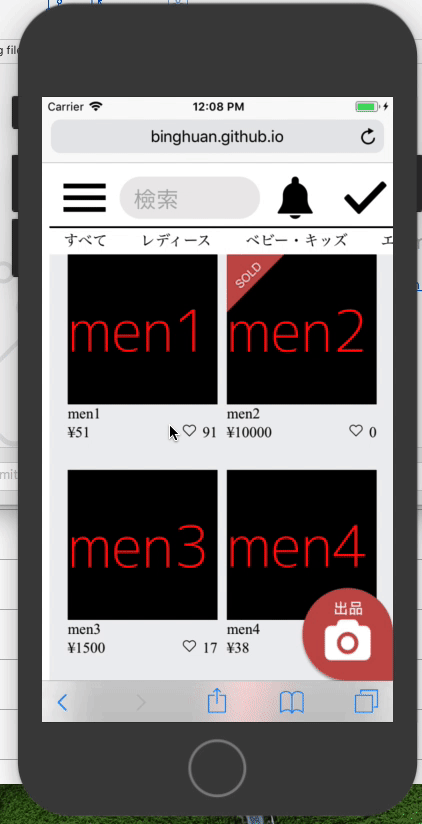
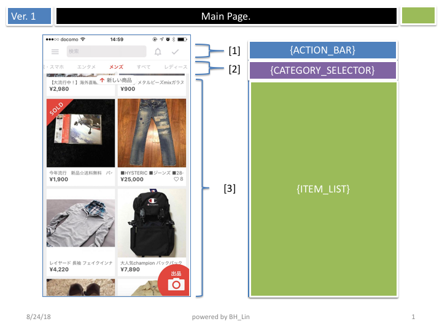
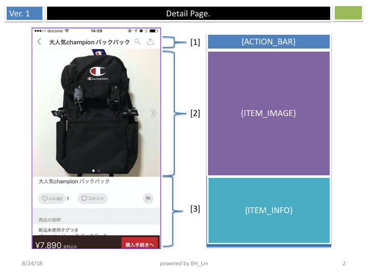
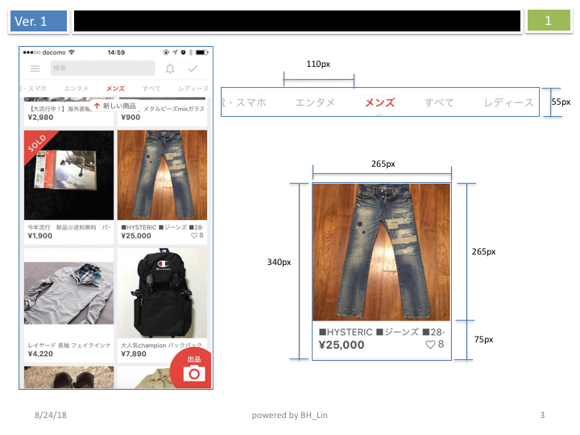
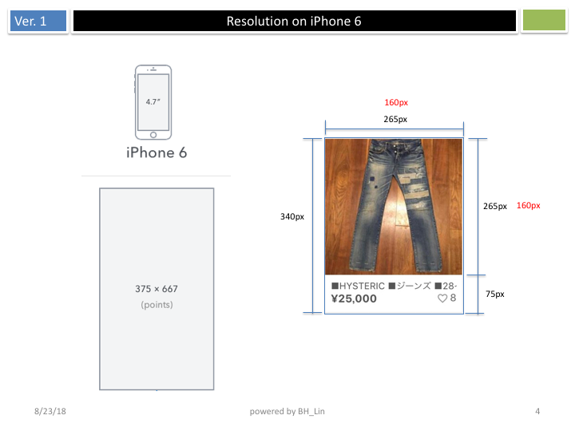
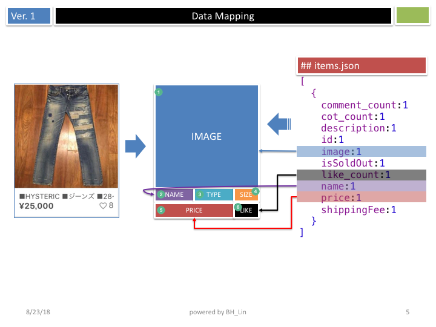
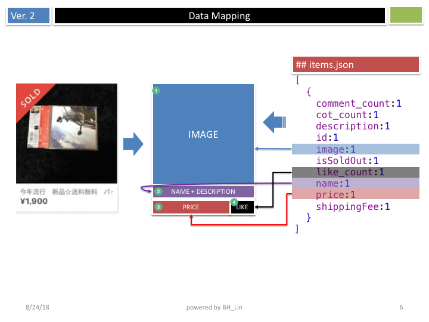
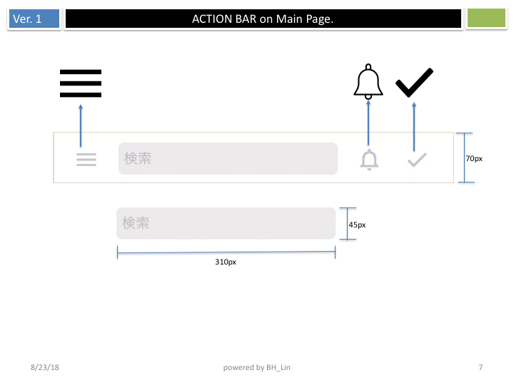

# MyMercari

<https://binghuan.github.io/MyMercari>

## Coding Quest from Mercari jp

### Pre-Conditions

* Implement using HTML/CSS/JavaScript.
  * You can use any additional tools or libraries which you want.
* Any design elements are not provided.
  * Create "Like" and "Comment" icons using design toolkit such like [Sketch](https://www.sketchapp.com/).
  * You can use attached screenshots for all other elements.
* An API server which sends JSON response is provided.
  * JSON data differ from the following spec images.
* Do NOT use any boilerplate such like `create react app`.

### Requirements

1. Implement a list and a detail page with refering the following spec images.
  * App will go to a detail page if an item in a list page is clicked.
2. Retrieve the item data via the provided API.
  * Refer to the attached `API.md` file to see API specs.
  * To use the API server, please start it at your environment with refering `API.md ##Launch API Server`.
3. Write how to start an app you wrote in README.
  * You can write about any intentions of your implementation if you need.

### Spec Images

### Data

